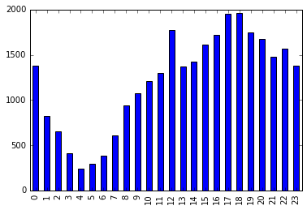
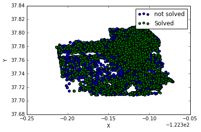

# San F. crime data


```python
import requests
import json
import csv
import datetime
import math
import pandas as pd 

url = "https://raw.githubusercontent.com/uwescience/datasci_course_materials/master/assignment6/sanfrancisco_incidents_summer_2014.csv"
sf_data = pd.read_csv(url, index_col='DateTime', parse_dates={'DateTime':['Date','Time']})

```


```python
sf_data
```


<div>
<table border="1" class="dataframe">
  <thead>
    <tr style="text-align: right;">
      <th></th>
      <th>IncidntNum</th>
      <th>Category</th>
      <th>Descript</th>
      <th>DayOfWeek</th>
      <th>PdDistrict</th>
      <th>Resolution</th>
      <th>Address</th>
      <th>X</th>
      <th>Y</th>
      <th>Location</th>
      <th>PdId</th>
      <th>hour</th>
    </tr>
    <tr>
      <th>DateTime</th>
      <th></th>
      <th></th>
      <th></th>
      <th></th>
      <th></th>
      <th></th>
      <th></th>
      <th></th>
      <th></th>
      <th></th>
      <th></th>
      <th></th>
    </tr>
  </thead>
  <tbody>
    <tr>
      <th>2014-08-31 23:50:00</th>
      <td>140734311</td>
      <td>ARSON</td>
      <td>ARSON OF A VEHICLE</td>
      <td>Sunday</td>
      <td>BAYVIEW</td>
      <td>NONE</td>
      <td>LOOMIS ST / INDUSTRIAL ST</td>
      <td>-122.405647</td>
      <td>37.738322</td>
      <td>(37.7383221869053, -122.405646994567)</td>
      <td>14073431126031</td>
      <td>23</td>
    </tr>
    <tr>
      <th>2014-08-31 23:45:00</th>
      <td>140736317</td>
      <td>NON-CRIMINAL</td>
      <td>LOST PROPERTY</td>
      <td>Sunday</td>
      <td>MISSION</td>
      <td>NONE</td>
      <td>400 Block of CASTRO ST</td>
      <td>-122.435012</td>
      <td>37.761768</td>
      <td>(37.7617677182954, -122.435012093789)</td>
      <td>14073631771000</td>
      <td>23</td>
    </tr>
    <tr>
      <th>2014-08-31 23:30:00</th>
      <td>146177923</td>
      <td>LARCENY/THEFT</td>
      <td>GRAND THEFT FROM LOCKED AUTO</td>
      <td>Sunday</td>
      <td>SOUTHERN</td>
      <td>NONE</td>
      <td>1000 Block of MISSION ST</td>
      <td>-122.409795</td>
      <td>37.780036</td>
      <td>(37.7800356268394, -122.409795194505)</td>
      <td>14617792306244</td>
      <td>23</td>
    </tr>
    <tr>
      <th>2014-08-31 23:30:00</th>
      <td>146177531</td>
      <td>LARCENY/THEFT</td>
      <td>GRAND THEFT FROM LOCKED AUTO</td>
      <td>Sunday</td>
      <td>RICHMOND</td>
      <td>NONE</td>
      <td>FULTON ST / 26TH AV</td>
      <td>-122.485263</td>
      <td>37.772518</td>
      <td>(37.7725176473142, -122.485262988324)</td>
      <td>14617753106244</td>
      <td>23</td>
    </tr>
    <tr>
      <th>2014-08-31 23:23:00</th>
      <td>140734220</td>
      <td>NON-CRIMINAL</td>
      <td>FOUND PROPERTY</td>
      <td>Sunday</td>
      <td>RICHMOND</td>
      <td>NONE</td>
      <td>800 Block of LA PLAYA ST</td>
      <td>-122.509895</td>
      <td>37.772313</td>
      <td>(37.7723131976814, -122.509895418239)</td>
      <td>14073422072000</td>
      <td>23</td>
    </tr>
    <tr>
      <th>2014-08-31 23:13:00</th>
      <td>140734349</td>
      <td>DRUG/NARCOTIC</td>
      <td>POSSESSION OF MARIJUANA</td>
      <td>Sunday</td>
      <td>SOUTHERN</td>
      <td>ARREST, BOOKED</td>
      <td>11TH ST / MINNA ST</td>
      <td>-122.416578</td>
      <td>37.773907</td>
      <td>(37.773907074489, -122.416578493475)</td>
      <td>14073434916010</td>
      <td>23</td>
    </tr>
    <tr>
      <th>2014-08-31 23:13:00</th>
      <td>140734349</td>
      <td>DRUG/NARCOTIC</td>
      <td>POSSESSION OF CONTROLLED SUBSTANCE FOR SALE</td>
      <td>Sunday</td>
      <td>SOUTHERN</td>
      <td>ARREST, BOOKED</td>
      <td>11TH ST / MINNA ST</td>
      <td>-122.416578</td>
      <td>37.773907</td>
      <td>(37.773907074489, -122.416578493475)</td>
      <td>14073434916662</td>
      <td>23</td>
    </tr>
    <tr>
      <th>2014-08-31 23:13:00</th>
      <td>140734349</td>
      <td>DRIVING UNDER THE INFLUENCE</td>
      <td>DRIVING WHILE UNDER THE INFLUENCE OF ALCOHOL</td>
      <td>Sunday</td>
      <td>SOUTHERN</td>
      <td>ARREST, BOOKED</td>
      <td>11TH ST / MINNA ST</td>
      <td>-122.416578</td>
      <td>37.773907</td>
      <td>(37.773907074489, -122.416578493475)</td>
      <td>14073434965050</td>
      <td>23</td>
    </tr>
    <tr>
      <th>2014-08-31 23:00:00</th>
      <td>140738147</td>
      <td>OTHER OFFENSES</td>
      <td>EVADING A POLICE OFFICER RECKLESSLY</td>
      <td>Sunday</td>
      <td>INGLESIDE</td>
      <td>NONE</td>
      <td>1400 Block of DOLORES ST</td>
      <td>-122.424498</td>
      <td>37.746649</td>
      <td>(37.7466488718366, -122.424497944857)</td>
      <td>14073814727175</td>
      <td>23</td>
    </tr>
    <tr>
      <th>2014-08-31 23:00:00</th>
      <td>140734258</td>
      <td>TRESPASS</td>
      <td>TRESPASSING</td>
      <td>Sunday</td>
      <td>CENTRAL</td>
      <td>ARREST, CITED</td>
      <td>900 Block of MASON ST</td>
      <td>-122.410846</td>
      <td>37.792316</td>
      <td>(37.7923158747647, -122.410845624227)</td>
      <td>14073425827195</td>
      <td>23</td>
    </tr>
    <tr>
      <th>2014-08-31 23:00:00</th>
      <td>140738711</td>
      <td>VEHICLE THEFT</td>
      <td>STOLEN TRUCK</td>
      <td>Sunday</td>
      <td>CENTRAL</td>
      <td>NONE</td>
      <td>800 Block of POST ST</td>
      <td>-122.415822</td>
      <td>37.787293</td>
      <td>(37.7872932910877, -122.415821891164)</td>
      <td>14073871107025</td>
      <td>23</td>
    </tr>
    <tr>
      <th>2014-08-31 23:00:00</th>
      <td>146178410</td>
      <td>LARCENY/THEFT</td>
      <td>PETTY THEFT OF PROPERTY</td>
      <td>Sunday</td>
      <td>CENTRAL</td>
      <td>NONE</td>
      <td>300 Block of BAY ST</td>
      <td>-122.412782</td>
      <td>37.805665</td>
      <td>(37.8056654684523, -122.412782236976)</td>
      <td>14617841006372</td>
      <td>23</td>
    </tr>
    <tr>
      <th>2014-08-31 23:00:00</th>
      <td>140787570</td>
      <td>NON-CRIMINAL</td>
      <td>LOST PROPERTY</td>
      <td>Sunday</td>
      <td>MISSION</td>
      <td>NONE</td>
      <td>600 Block of VALENCIA ST</td>
      <td>-122.421550</td>
      <td>37.762131</td>
      <td>(37.7621307247611, -122.421550176461)</td>
      <td>14078757071000</td>
      <td>23</td>
    </tr>
    <tr>
      <th>2014-08-31 23:00:00</th>
      <td>140735604</td>
      <td>VEHICLE THEFT</td>
      <td>STOLEN AUTOMOBILE</td>
      <td>Sunday</td>
      <td>MISSION</td>
      <td>NONE</td>
      <td>GUERRERO ST / CESAR CHAVEZ ST</td>
      <td>-122.422490</td>
      <td>37.748014</td>
      <td>(37.7480144418715, -122.42249041028)</td>
      <td>14073560407021</td>
      <td>23</td>
    </tr>
    <tr>
      <th>2014-08-31 23:00:00</th>
      <td>140738147</td>
      <td>VEHICLE THEFT</td>
      <td>STOLEN MOTORCYCLE</td>
      <td>Sunday</td>
      <td>INGLESIDE</td>
      <td>NONE</td>
      <td>1400 Block of DOLORES ST</td>
      <td>-122.424498</td>
      <td>37.746649</td>
      <td>(37.7466488718366, -122.424497944857)</td>
      <td>14073814707023</td>
      <td>23</td>
    </tr>
    <tr>
      <th>2014-08-31 22:58:00</th>
      <td>140734145</td>
      <td>ASSAULT</td>
      <td>BATTERY</td>
      <td>Sunday</td>
      <td>MISSION</td>
      <td>ARREST, CITED</td>
      <td>1000 Block of POTRERO AV</td>
      <td>-122.406539</td>
      <td>37.756486</td>
      <td>(37.7564864109309, -122.406539115148)</td>
      <td>14073414504134</td>
      <td>22</td>
    </tr>
    <tr>
      <th>2014-08-31 22:51:00</th>
      <td>140734214</td>
      <td>FRAUD</td>
      <td>DEFRAUDING AN INNKEEPER</td>
      <td>Sunday</td>
      <td>CENTRAL</td>
      <td>NONE</td>
      <td>200 Block of JEFFERSON ST</td>
      <td>-122.416629</td>
      <td>37.808057</td>
      <td>(37.8080574789267, -122.416629414907)</td>
      <td>14073421427010</td>
      <td>22</td>
    </tr>
    <tr>
      <th>2014-08-31 22:51:00</th>
      <td>140734214</td>
      <td>ASSAULT</td>
      <td>AGGRAVATED ASSAULT WITH BODILY FORCE</td>
      <td>Sunday</td>
      <td>CENTRAL</td>
      <td>NONE</td>
      <td>200 Block of JEFFERSON ST</td>
      <td>-122.416629</td>
      <td>37.808057</td>
      <td>(37.8080574789267, -122.416629414907)</td>
      <td>14073421404014</td>
      <td>22</td>
    </tr>
    <tr>
      <th>2014-08-31 22:38:00</th>
      <td>140734098</td>
      <td>SUSPICIOUS OCC</td>
      <td>SUSPICIOUS OCCURRENCE</td>
      <td>Sunday</td>
      <td>SOUTHERN</td>
      <td>NONE</td>
      <td>10TH ST / HOWARD ST</td>
      <td>-122.414371</td>
      <td>37.774042</td>
      <td>(37.7740418385041, -122.414370627495)</td>
      <td>14073409864070</td>
      <td>22</td>
    </tr>
    <tr>
      <th>2014-08-31 22:38:00</th>
      <td>140734098</td>
      <td>NON-CRIMINAL</td>
      <td>FOUND PROPERTY</td>
      <td>Sunday</td>
      <td>SOUTHERN</td>
      <td>NONE</td>
      <td>10TH ST / HOWARD ST</td>
      <td>-122.414371</td>
      <td>37.774042</td>
      <td>(37.7740418385041, -122.414370627495)</td>
      <td>14073409872000</td>
      <td>22</td>
    </tr>
    <tr>
      <th>2014-08-31 22:35:00</th>
      <td>140734123</td>
      <td>SECONDARY CODES</td>
      <td>DOMESTIC VIOLENCE</td>
      <td>Sunday</td>
      <td>MISSION</td>
      <td>NONE</td>
      <td>3000 Block of FOLSOM ST</td>
      <td>-122.413765</td>
      <td>37.748532</td>
      <td>(37.7485319183987, -122.413765068125)</td>
      <td>14073412315200</td>
      <td>22</td>
    </tr>
    <tr>
      <th>2014-08-31 22:35:00</th>
      <td>140734123</td>
      <td>ASSAULT</td>
      <td>THREATS AGAINST LIFE</td>
      <td>Sunday</td>
      <td>MISSION</td>
      <td>NONE</td>
      <td>3000 Block of FOLSOM ST</td>
      <td>-122.413765</td>
      <td>37.748532</td>
      <td>(37.7485319183987, -122.413765068125)</td>
      <td>14073412319057</td>
      <td>22</td>
    </tr>
    <tr>
      <th>2014-08-31 22:30:00</th>
      <td>140734822</td>
      <td>LARCENY/THEFT</td>
      <td>PETTY THEFT FROM LOCKED AUTO</td>
      <td>Sunday</td>
      <td>CENTRAL</td>
      <td>NONE</td>
      <td>MONTGOMERY ST / PACIFIC AV</td>
      <td>-122.403678</td>
      <td>37.797297</td>
      <td>(37.7972972029479, -122.403678112414)</td>
      <td>14073482206241</td>
      <td>22</td>
    </tr>
    <tr>
      <th>2014-08-31 22:30:00</th>
      <td>146178476</td>
      <td>LARCENY/THEFT</td>
      <td>GRAND THEFT FROM LOCKED AUTO</td>
      <td>Sunday</td>
      <td>SOUTHERN</td>
      <td>NONE</td>
      <td>HARRISON ST / 11TH ST</td>
      <td>-122.412483</td>
      <td>37.770631</td>
      <td>(37.7706305910776, -122.41248326348)</td>
      <td>14617847606244</td>
      <td>22</td>
    </tr>
    <tr>
      <th>2014-08-31 22:18:00</th>
      <td>146179355</td>
      <td>LARCENY/THEFT</td>
      <td>GRAND THEFT FROM UNLOCKED AUTO</td>
      <td>Sunday</td>
      <td>NORTHERN</td>
      <td>NONE</td>
      <td>LARKIN ST / PINE ST</td>
      <td>-122.418845</td>
      <td>37.789830</td>
      <td>(37.7898297669592, -122.418844748098)</td>
      <td>14617935506224</td>
      <td>22</td>
    </tr>
    <tr>
      <th>2014-08-31 22:10:00</th>
      <td>140734151</td>
      <td>OTHER OFFENSES</td>
      <td>MISCELLANEOUS INVESTIGATION</td>
      <td>Sunday</td>
      <td>SOUTHERN</td>
      <td>NONE</td>
      <td>100 Block of STEUART ST</td>
      <td>-122.392350</td>
      <td>37.792645</td>
      <td>(37.7926450897756, -122.392349764257)</td>
      <td>14073415168020</td>
      <td>22</td>
    </tr>
    <tr>
      <th>2014-08-31 22:01:00</th>
      <td>140734010</td>
      <td>ASSAULT</td>
      <td>SHOOTING INTO INHABITED DWELLING OR OCCUPIED V...</td>
      <td>Sunday</td>
      <td>BAYVIEW</td>
      <td>ARREST, BOOKED</td>
      <td>0 Block of OLMSTEAD ST</td>
      <td>-122.402130</td>
      <td>37.722755</td>
      <td>(37.7227554286725, -122.402130234805)</td>
      <td>14073401004081</td>
      <td>22</td>
    </tr>
    <tr>
      <th>2014-08-31 22:01:00</th>
      <td>140734010</td>
      <td>WEAPON LAWS</td>
      <td>POSS OF FIREARM BY CONVICTED FELON/ADDICT/ALIEN</td>
      <td>Sunday</td>
      <td>BAYVIEW</td>
      <td>ARREST, BOOKED</td>
      <td>0 Block of OLMSTEAD ST</td>
      <td>-122.402130</td>
      <td>37.722755</td>
      <td>(37.7227554286725, -122.402130234805)</td>
      <td>14073401012080</td>
      <td>22</td>
    </tr>
    <tr>
      <th>2014-08-31 22:01:00</th>
      <td>140734010</td>
      <td>OTHER OFFENSES</td>
      <td>CRUELTY TO ANIMALS</td>
      <td>Sunday</td>
      <td>BAYVIEW</td>
      <td>ARREST, BOOKED</td>
      <td>0 Block of OLMSTEAD ST</td>
      <td>-122.402130</td>
      <td>37.722755</td>
      <td>(37.7227554286725, -122.402130234805)</td>
      <td>14073401028010</td>
      <td>22</td>
    </tr>
    <tr>
      <th>2014-08-31 22:00:00</th>
      <td>140736624</td>
      <td>VEHICLE THEFT</td>
      <td>STOLEN AUTOMOBILE</td>
      <td>Sunday</td>
      <td>INGLESIDE</td>
      <td>NONE</td>
      <td>400 Block of DELTA ST</td>
      <td>-122.409113</td>
      <td>37.714150</td>
      <td>(37.714150230756, -122.40911287775)</td>
      <td>14073662407021</td>
      <td>22</td>
    </tr>
    <tr>
      <th>...</th>
      <td>...</td>
      <td>...</td>
      <td>...</td>
      <td>...</td>
      <td>...</td>
      <td>...</td>
      <td>...</td>
      <td>...</td>
      <td>...</td>
      <td>...</td>
      <td>...</td>
      <td>...</td>
    </tr>
    <tr>
      <th>2014-06-01 01:00:00</th>
      <td>146110064</td>
      <td>NON-CRIMINAL</td>
      <td>LOST PROPERTY</td>
      <td>Sunday</td>
      <td>SOUTHERN</td>
      <td>NONE</td>
      <td>300 Block of 11TH ST</td>
      <td>-122.413189</td>
      <td>37.771274</td>
      <td>(37.7712736913576, -122.413189430011)</td>
      <td>14611006471000</td>
      <td>1</td>
    </tr>
    <tr>
      <th>2014-06-01 01:00:00</th>
      <td>146114903</td>
      <td>LARCENY/THEFT</td>
      <td>GRAND THEFT FROM LOCKED AUTO</td>
      <td>Sunday</td>
      <td>SOUTHERN</td>
      <td>NONE</td>
      <td>100 Block of 7TH ST</td>
      <td>-122.410111</td>
      <td>37.778632</td>
      <td>(37.7786320490341, -122.410111373792)</td>
      <td>14611490306244</td>
      <td>1</td>
    </tr>
    <tr>
      <th>2014-06-01 00:54:00</th>
      <td>146105009</td>
      <td>NON-CRIMINAL</td>
      <td>LOST PROPERTY</td>
      <td>Sunday</td>
      <td>CENTRAL</td>
      <td>NONE</td>
      <td>2800 Block of LEAVENWORTH ST</td>
      <td>-122.419067</td>
      <td>37.807334</td>
      <td>(37.8073339305952, -122.419067224379)</td>
      <td>14610500971000</td>
      <td>0</td>
    </tr>
    <tr>
      <th>2014-06-01 00:40:00</th>
      <td>146105065</td>
      <td>LARCENY/THEFT</td>
      <td>GRAND THEFT FROM LOCKED AUTO</td>
      <td>Sunday</td>
      <td>CENTRAL</td>
      <td>NONE</td>
      <td>SUTTER ST / LEAVENWORTH ST</td>
      <td>-122.415187</td>
      <td>37.788387</td>
      <td>(37.7883866790789, -122.415186938172)</td>
      <td>14610506506244</td>
      <td>0</td>
    </tr>
    <tr>
      <th>2014-06-01 00:30:00</th>
      <td>146105504</td>
      <td>LARCENY/THEFT</td>
      <td>PETTY THEFT OF PROPERTY</td>
      <td>Sunday</td>
      <td>SOUTHERN</td>
      <td>NONE</td>
      <td>300 Block of 11TH ST</td>
      <td>-122.413189</td>
      <td>37.771274</td>
      <td>(37.7712736913576, -122.413189430011)</td>
      <td>14610550406372</td>
      <td>0</td>
    </tr>
    <tr>
      <th>2014-06-01 00:30:00</th>
      <td>146105554</td>
      <td>LARCENY/THEFT</td>
      <td>PETTY THEFT OF PROPERTY</td>
      <td>Sunday</td>
      <td>SOUTHERN</td>
      <td>NONE</td>
      <td>1100 Block of FOLSOM ST</td>
      <td>-122.409185</td>
      <td>37.775608</td>
      <td>(37.7756080205266, -122.409184636157)</td>
      <td>14610555406372</td>
      <td>0</td>
    </tr>
    <tr>
      <th>2014-06-01 00:28:00</th>
      <td>140455711</td>
      <td>LARCENY/THEFT</td>
      <td>THEFT OF CHECKS OR CREDIT CARDS</td>
      <td>Sunday</td>
      <td>MISSION</td>
      <td>NONE</td>
      <td>500 Block of VALENCIA ST</td>
      <td>-122.421876</td>
      <td>37.764089</td>
      <td>(37.7640888944532, -122.421876488492)</td>
      <td>14045571106125</td>
      <td>0</td>
    </tr>
    <tr>
      <th>2014-06-01 00:28:00</th>
      <td>140455711</td>
      <td>LARCENY/THEFT</td>
      <td>THEFT OF COMPUTERS OR CELL PHONES</td>
      <td>Sunday</td>
      <td>MISSION</td>
      <td>NONE</td>
      <td>500 Block of VALENCIA ST</td>
      <td>-122.421876</td>
      <td>37.764089</td>
      <td>(37.7640888944532, -122.421876488492)</td>
      <td>14045571106126</td>
      <td>0</td>
    </tr>
    <tr>
      <th>2014-06-01 00:25:00</th>
      <td>140455705</td>
      <td>WARRANTS</td>
      <td>ENROUTE TO OUTSIDE JURISDICTION</td>
      <td>Sunday</td>
      <td>SOUTHERN</td>
      <td>ARREST, BOOKED</td>
      <td>0 Block of 12TH ST</td>
      <td>-122.420001</td>
      <td>37.774095</td>
      <td>(37.7740948566882, -122.420001436964)</td>
      <td>14045570562050</td>
      <td>0</td>
    </tr>
    <tr>
      <th>2014-06-01 00:25:00</th>
      <td>140455705</td>
      <td>WARRANTS</td>
      <td>WARRANT ARREST</td>
      <td>Sunday</td>
      <td>SOUTHERN</td>
      <td>ARREST, BOOKED</td>
      <td>0 Block of 12TH ST</td>
      <td>-122.420001</td>
      <td>37.774095</td>
      <td>(37.7740948566882, -122.420001436964)</td>
      <td>14045570563010</td>
      <td>0</td>
    </tr>
    <tr>
      <th>2014-06-01 00:10:00</th>
      <td>140636701</td>
      <td>OTHER OFFENSES</td>
      <td>FALSE PERSONATION</td>
      <td>Sunday</td>
      <td>NORTHERN</td>
      <td>NONE</td>
      <td>2400 Block of FRANCISCO ST</td>
      <td>-122.445553</td>
      <td>37.800643</td>
      <td>(37.8006433397575, -122.44555304859)</td>
      <td>14063670109027</td>
      <td>0</td>
    </tr>
    <tr>
      <th>2014-06-01 00:10:00</th>
      <td>140456032</td>
      <td>TRESPASS</td>
      <td>TRESPASSING</td>
      <td>Sunday</td>
      <td>SOUTHERN</td>
      <td>ARREST, BOOKED</td>
      <td>200 Block of INTERSTATE80 HY</td>
      <td>-122.365565</td>
      <td>37.809671</td>
      <td>(37.8096707013239, -122.365565425353)</td>
      <td>14045603227195</td>
      <td>0</td>
    </tr>
    <tr>
      <th>2014-06-01 00:01:00</th>
      <td>150091383</td>
      <td>TRESPASS</td>
      <td>TRESPASSING</td>
      <td>Sunday</td>
      <td>INGLESIDE</td>
      <td>NONE</td>
      <td>300 Block of CRESTAVISTA DR</td>
      <td>-122.452915</td>
      <td>37.735578</td>
      <td>(37.735578379099, -122.452915479002)</td>
      <td>15009138327195</td>
      <td>0</td>
    </tr>
    <tr>
      <th>2014-06-01 00:01:00</th>
      <td>150091383</td>
      <td>SUSPICIOUS OCC</td>
      <td>SUSPICIOUS OCCURRENCE</td>
      <td>Sunday</td>
      <td>INGLESIDE</td>
      <td>NONE</td>
      <td>300 Block of CRESTAVISTA DR</td>
      <td>-122.452915</td>
      <td>37.735578</td>
      <td>(37.735578379099, -122.452915479002)</td>
      <td>15009138364070</td>
      <td>0</td>
    </tr>
    <tr>
      <th>2014-06-01 00:01:00</th>
      <td>150099149</td>
      <td>LARCENY/THEFT</td>
      <td>PETTY THEFT FROM A BUILDING</td>
      <td>Sunday</td>
      <td>INGLESIDE</td>
      <td>NONE</td>
      <td>500 Block of LISBON ST</td>
      <td>-122.435324</td>
      <td>37.719624</td>
      <td>(37.7196244173065, -122.435323872787)</td>
      <td>15009914906303</td>
      <td>0</td>
    </tr>
    <tr>
      <th>2014-06-01 00:01:00</th>
      <td>140605461</td>
      <td>OTHER OFFENSES</td>
      <td>FALSE PERSONATION</td>
      <td>Sunday</td>
      <td>TENDERLOIN</td>
      <td>NONE</td>
      <td>200 Block of TURK ST</td>
      <td>-122.413259</td>
      <td>37.782951</td>
      <td>(37.7829514828801, -122.413259498719)</td>
      <td>14060546109027</td>
      <td>0</td>
    </tr>
    <tr>
      <th>2014-06-01 00:01:00</th>
      <td>140626865</td>
      <td>LARCENY/THEFT</td>
      <td>EMBEZZLEMENT FROM DEPENDENT OR ELDER ADULT BY ...</td>
      <td>Sunday</td>
      <td>TENDERLOIN</td>
      <td>NONE</td>
      <td>400 Block of TURK ST</td>
      <td>-122.416349</td>
      <td>37.782557</td>
      <td>(37.7825569563078, -122.416349428183)</td>
      <td>14062686506381</td>
      <td>0</td>
    </tr>
    <tr>
      <th>2014-06-01 00:01:00</th>
      <td>140626865</td>
      <td>LARCENY/THEFT</td>
      <td>THEFT OF CHECKS OR CREDIT CARDS</td>
      <td>Sunday</td>
      <td>TENDERLOIN</td>
      <td>NONE</td>
      <td>400 Block of TURK ST</td>
      <td>-122.416349</td>
      <td>37.782557</td>
      <td>(37.7825569563078, -122.416349428183)</td>
      <td>14062686506125</td>
      <td>0</td>
    </tr>
    <tr>
      <th>2014-06-01 00:01:00</th>
      <td>140691733</td>
      <td>OTHER OFFENSES</td>
      <td>FALSE PERSONATION TO RECEIVE MONEY OR PROPERTY</td>
      <td>Sunday</td>
      <td>RICHMOND</td>
      <td>NONE</td>
      <td>2500 Block of POST ST</td>
      <td>-122.443821</td>
      <td>37.783736</td>
      <td>(37.7837356633095, -122.443820967808)</td>
      <td>14069173309029</td>
      <td>0</td>
    </tr>
    <tr>
      <th>2014-06-01 00:01:00</th>
      <td>140457331</td>
      <td>FRAUD</td>
      <td>FRAUDULENT USE OF AUTOMATED TELLER CARD</td>
      <td>Sunday</td>
      <td>MISSION</td>
      <td>NONE</td>
      <td>VALENCIA ST / 16TH ST</td>
      <td>-122.421886</td>
      <td>37.764918</td>
      <td>(37.7649178909424, -122.421886357981)</td>
      <td>14045733109250</td>
      <td>0</td>
    </tr>
    <tr>
      <th>2014-06-01 00:01:00</th>
      <td>140801415</td>
      <td>OTHER OFFENSES</td>
      <td>VIOLATION OF RESTRAINING ORDER</td>
      <td>Sunday</td>
      <td>CENTRAL</td>
      <td>NONE</td>
      <td>100 Block of PFEIFFER ST</td>
      <td>-122.408925</td>
      <td>37.804717</td>
      <td>(37.8047174943139, -122.408924999704)</td>
      <td>14080141515161</td>
      <td>0</td>
    </tr>
    <tr>
      <th>2014-06-01 00:01:00</th>
      <td>146106938</td>
      <td>LARCENY/THEFT</td>
      <td>GRAND THEFT FROM LOCKED AUTO</td>
      <td>Sunday</td>
      <td>MISSION</td>
      <td>NONE</td>
      <td>SHOTWELL ST / 16TH ST</td>
      <td>-122.416390</td>
      <td>37.765249</td>
      <td>(37.7652491154383, -122.416389710283)</td>
      <td>14610693806244</td>
      <td>0</td>
    </tr>
    <tr>
      <th>2014-06-01 00:01:00</th>
      <td>141085064</td>
      <td>OTHER OFFENSES</td>
      <td>FALSE PERSONATION TO RECEIVE MONEY OR PROPERTY</td>
      <td>Sunday</td>
      <td>PARK</td>
      <td>NONE</td>
      <td>200 Block of DOWNEY ST</td>
      <td>-122.446917</td>
      <td>37.765385</td>
      <td>(37.7653845336286, -122.446916939832)</td>
      <td>14108506409029</td>
      <td>0</td>
    </tr>
    <tr>
      <th>2014-06-01 00:01:00</th>
      <td>146107033</td>
      <td>LARCENY/THEFT</td>
      <td>GRAND THEFT OF PROPERTY</td>
      <td>Sunday</td>
      <td>MISSION</td>
      <td>NONE</td>
      <td>2300 Block of MARKET ST</td>
      <td>-122.434036</td>
      <td>37.763294</td>
      <td>(37.7632941952462, -122.43403618214)</td>
      <td>14610703306374</td>
      <td>0</td>
    </tr>
    <tr>
      <th>2014-06-01 00:01:00</th>
      <td>146108495</td>
      <td>LARCENY/THEFT</td>
      <td>GRAND THEFT FROM LOCKED AUTO</td>
      <td>Sunday</td>
      <td>INGLESIDE</td>
      <td>NONE</td>
      <td>100 Block of DETROIT ST</td>
      <td>-122.444350</td>
      <td>37.728685</td>
      <td>(37.7286852958895, -122.444349849922)</td>
      <td>14610849506244</td>
      <td>0</td>
    </tr>
    <tr>
      <th>2014-06-01 00:01:00</th>
      <td>140763495</td>
      <td>NON-CRIMINAL</td>
      <td>LOST PROPERTY</td>
      <td>Sunday</td>
      <td>SOUTHERN</td>
      <td>NONE</td>
      <td>700 Block of MARKET ST</td>
      <td>-122.404757</td>
      <td>37.786454</td>
      <td>(37.7864540511999, -122.404756583284)</td>
      <td>14076349571000</td>
      <td>0</td>
    </tr>
    <tr>
      <th>2014-06-01 00:01:00</th>
      <td>140779301</td>
      <td>ASSAULT</td>
      <td>THREATS AGAINST LIFE</td>
      <td>Sunday</td>
      <td>SOUTHERN</td>
      <td>NONE</td>
      <td>300 Block of KING ST</td>
      <td>-122.395022</td>
      <td>37.775313</td>
      <td>(37.7753128522284, -122.395021745914)</td>
      <td>14077930119057</td>
      <td>0</td>
    </tr>
    <tr>
      <th>2014-06-01 00:01:00</th>
      <td>140908839</td>
      <td>LARCENY/THEFT</td>
      <td>PETTY THEFT FROM A BUILDING</td>
      <td>Sunday</td>
      <td>NORTHERN</td>
      <td>NONE</td>
      <td>900 Block of FRANKLIN ST</td>
      <td>-122.422581</td>
      <td>37.782919</td>
      <td>(37.7829192180689, -122.42258112165)</td>
      <td>14090883906303</td>
      <td>0</td>
    </tr>
    <tr>
      <th>2014-06-01 00:01:00</th>
      <td>140908839</td>
      <td>LARCENY/THEFT</td>
      <td>PETTY THEFT BICYCLE</td>
      <td>Sunday</td>
      <td>NORTHERN</td>
      <td>NONE</td>
      <td>900 Block of FRANKLIN ST</td>
      <td>-122.422581</td>
      <td>37.782919</td>
      <td>(37.7829192180689, -122.42258112165)</td>
      <td>14090883906313</td>
      <td>0</td>
    </tr>
    <tr>
      <th>2014-06-01 00:01:00</th>
      <td>141017556</td>
      <td>NON-CRIMINAL</td>
      <td>LOST PROPERTY</td>
      <td>Sunday</td>
      <td>NORTHERN</td>
      <td>NONE</td>
      <td>600 Block of LARKIN ST</td>
      <td>-122.417645</td>
      <td>37.783553</td>
      <td>(37.7835527835511, -122.417645333839)</td>
      <td>14101755671000</td>
      <td>0</td>
    </tr>
  </tbody>
</table>
<p>28993 rows × 12 columns</p>
</div>


```python
%matplotlib inline

```


```python
sf_data['hour'] = sf_data.index.hour
sf_data_counts = sf_data['hour'].value_counts()
sf_data_counts.sort_index().plot(kind='bar')
```


    <matplotlib.axes._subplots.AxesSubplot at 0x103e6240>





It seems that most of crimes occurred during the afternoon, maybe when people are out from work. It is very strange that around 12 there is a pick - maybe launch time? so there is crimes when there are people outside..


```python
sf_data_cat_counts = sf_data['Category'].value_counts()
sf_data_cat_counts_frame =sf_data_cat_counts.to_frame(name = 'Count')
high= sf_data_cat_counts_frame['Count']>1000
low= sf_data_cat_counts_frame['Count']<1000
sf_data_sum= sf_data_cat_counts_frame[low].sum()
sum1 =sf_data_cat_counts_frame[high].loc['OTHER OFFENSES']['Count'] + sf_data_sum
sf_high = sf_data_cat_counts_frame[high]
```

I have created a new data frame with the count per Category and all the categories with less than 1000 I have added to 'other offenses' in the next line code.


```python
sf_high.loc['OTHER OFFENSES']['Count'] = sum1
sf_high
```


<div>
<table border="1" class="dataframe">
  <thead>
    <tr style="text-align: right;">
      <th></th>
      <th>Count</th>
    </tr>
  </thead>
  <tbody>
    <tr>
      <th>LARCENY/THEFT</th>
      <td>9466</td>
    </tr>
    <tr>
      <th>OTHER OFFENSES</th>
      <td>5963</td>
    </tr>
    <tr>
      <th>NON-CRIMINAL</th>
      <td>3023</td>
    </tr>
    <tr>
      <th>ASSAULT</th>
      <td>2882</td>
    </tr>
    <tr>
      <th>VEHICLE THEFT</th>
      <td>1966</td>
    </tr>
    <tr>
      <th>WARRANTS</th>
      <td>1782</td>
    </tr>
    <tr>
      <th>DRUG/NARCOTIC</th>
      <td>1345</td>
    </tr>
    <tr>
      <th>SUSPICIOUS OCC</th>
      <td>1300</td>
    </tr>
    <tr>
      <th>MISSING PERSON</th>
      <td>1266</td>
    </tr>
  </tbody>
</table>
</div>


```python
sf_high.plot.pie(y='Count',legend=False)
```


    <matplotlib.axes._subplots.AxesSubplot at 0x11fa7898>


Ones can see (even that I miss the percentages here) that 'Theft' is the most common by far - more than 30%. The assault is also common and it have some relation to the previews chart, and when people outside on the streets. I was a bit supersized on the missing person it is common as drags!
In the next chart I will try to look on the solved cases ratio and to see if there are some areas which attened to not been solved.


```python
none = sf_data['Resolution'] == 'NONE'
solved = sf_data['Resolution'] != 'NONE'
ax = sf_data[none].plot(kind='scatter', x='X', y='Y', color='Blue', label='not solved');
sf_data[solved].plot(kind='scatter', x='X', y='Y', color='Green', label='Solved', ax=ax);
```





I dont know the city but it seems to me that here are some areas which cases do not slove as others areas..
Thanks,
