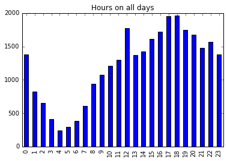
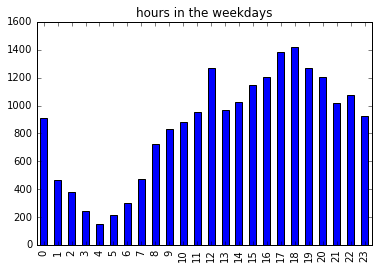
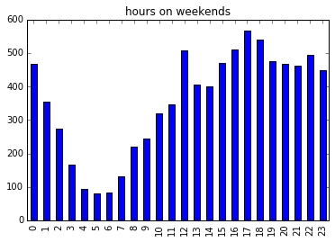
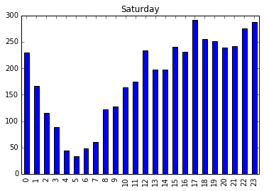
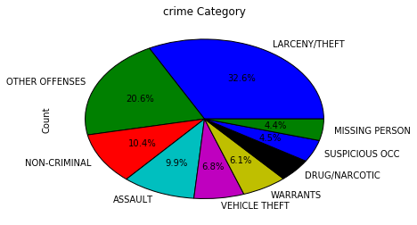
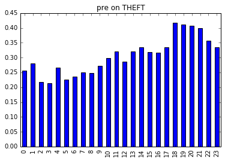
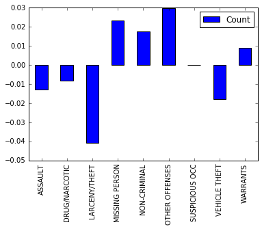
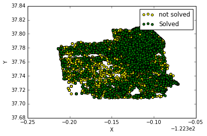

# San Francisco crime data 

When start to look on crime data of San Francisco in summer 2014, I tried to see if there are hours in the day which have more crimes and why does it happend. 
In the end I tried to see if there are areas which cases are not ben solved.

First- I collected the data and open it as csv:


```python
import requests
import datetime
import pandas as pd 
import numpy as np
import matplotlib.pyplot as plt
url = "https://raw.githubusercontent.com/uwescience/datasci_course_materials/master/assignment6/sanfrancisco_incidents_summer_2014.csv"
sf_data = pd.read_csv(url, index_col='DateTime', parse_dates={'DateTime':['Date','Time']})
%matplotlib inline
```

### Hours analysis

Creating an 'hour' of the day column and plot the count outcome. 


```python
sf_data['hour'] = sf_data.index.hour
sf_data_counts = sf_data['hour'].value_counts()
sf_data_counts.sort_index().plot(kind='bar', title = 'Hours on all days')
```


    <matplotlib.axes._subplots.AxesSubplot at 0xd36c2b0>





It seems from this bar chart that the most crimes happned when pepole are outside there offices- when going back from the offices and in the launch time. Ofcouese the evning to night hours are also very busy. To be more sure on it I devided it into weekdays and weekend days.


```python
sf_data['weekLabel'] = np.where((sf_data['DayOfWeek']=='Sunday') | (sf_data['DayOfWeek']=='Saturday') , 'Weekend', 'Weekday')
weekdays_hours_counts = sf_data[sf_data['weekLabel']=='Weekday']['hour'].value_counts() 
weekdays_hours_counts.sort_index().plot(kind='bar', title = 'hours in the weekdays')
```


    <matplotlib.axes._subplots.AxesSubplot at 0x3957208>





OK, that seems to be the same. Lets check the weekends:


```python
weekends_hours_counts = sf_data[sf_data['weekLabel']=='Weekend']['hour'].value_counts() 
weekends_hours_counts.sort_index().plot(kind='bar', title= 'hours on weekends')
```


    <matplotlib.axes._subplots.AxesSubplot at 0xd7ed160>





It also seems to look the same.. Maybe we need to look only on Saturday becuse it is the day when pepole attend to not go out in the noon becouse they have dinners.


```python
saturday_hours_counts = sf_data[sf_data['DayOfWeek']=='Saturday']['hour'].value_counts() 
saturday_hours_counts.sort_index().plot(kind='bar',title ='Saturday')
```


    <matplotlib.axes._subplots.AxesSubplot at 0xd7499b0>





OK, the numbers a bit low to be sure, and it is not very obius but maybe the picks are when pepole on the way on the street- going to eat or drink or go home.. (we can see that on Saturday, when pepole go out late the hours with more crimes are at night)
So crimes happend when pepole out on the streets.

### Crime Label

When looking on the count of the crimes in each label I saw there are few that have very low number of crimes. So I have added all of thouse that have less then 1000 to the 'other offenses' label.


```python
sf_data_cat_counts = sf_data['Category'].value_counts()
sf_data_cat_counts_frame =sf_data_cat_counts.to_frame(name = 'Count')
high= sf_data_cat_counts_frame['Count']>1000
low= sf_data_cat_counts_frame['Count']<1000
sf_data_sum= sf_data_cat_counts_frame[low].sum()
sum1 =sf_data_cat_counts_frame[high].loc['OTHER OFFENSES']['Count'] + sf_data_sum
sf_high = sf_data_cat_counts_frame[high]
```


```python
sf_high.loc['OTHER OFFENSES']['Count'] = sum1
```

lets plot it on pie. 


```python
sf_high.plot.pie(y='Count',legend=False,autopct='%1.1f%%',title='crime Category')
```


    <matplotlib.axes._subplots.AxesSubplot at 0xed35940>




I was a bit supersized on the missing person is common as drags! One can see that 'Theft' is the most common by far - more than 30%. The assault is also common. Maybe it is make sense with the previews charts - when people outside on the streets there are crimes. lets check the precentages of theft during the hours. 

```python
thheft_counts = sf_data[sf_data['Category']=='LARCENY/THEFT']['hour'].value_counts()
all_counts = sf_data['hour'].value_counts() 
pre = thheft_counts/all_counts
pre.sort_index().plot(kind='bar', title = 'pre on THEFT')
```


    <matplotlib.axes._subplots.AxesSubplot at 0x10b87160>





So not exactley what I thought. lets look on all the diffrensess in presentages by category between 12 to all other hours.


```python
category_counts_noon = sf_data[sf_data['hour']==12]['Category'].value_counts().to_frame(name = 'Count') 
category_counts_noon.loc['OTHER OFFENSES']['Count'] = category_counts_noon.loc['OTHER OFFENSES']['Count'] + category_counts_noon[low].sum()
#sf_high
noon_pre=category_counts_noon[high]/category_counts_noon[high].sum()
sf_high_pre = sf_high/sf_high.sum()
(noon_pre - sf_high_pre).plot(kind='bar')
```


    <matplotlib.axes._subplots.AxesSubplot at 0x12807a58>





So the diffrenet is becouse of changes in other offeness, non criminal and missing person. Maybe pepole just really boring outthere at noon. 

###  un solved areas

In the next chart I will try to look on the solved cases ratio and to see if there are some areas which attened to not been solved.


```python
none = sf_data['Resolution'] == 'NONE'
solved = sf_data['Resolution'] != 'NONE'
ax = sf_data[none].plot(kind='scatter', x='X', y='Y', color='yellow', label='not solved');
sf_data[solved].plot(kind='scatter', x='X', y='Y', color='Green', label='Solved', ax=ax);
```





So also there is area (where it is yellow) that cases are attend to not been solved at all. 
Most of it in the center of the city. 
